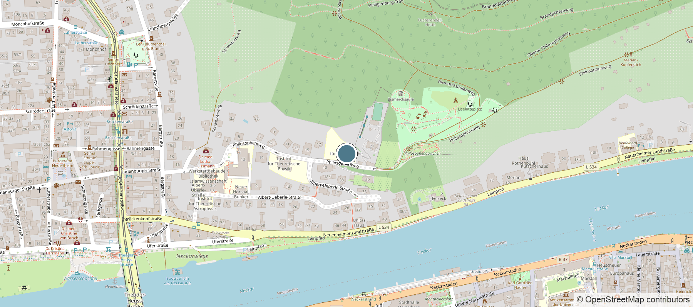

<!-- No `.content-block` wrapper: it is defined only in index.css, which only
index.qmd loads, so it styled nothing here. -->

Email is the reliable way to reach me. If you are writing about a **Bachelor's
or Master's thesis**, or about a **PhD or postdoc position**, please read the
[open positions](positions.html) page first and say in your message which
topics interest you — it makes for a much shorter exchange than a general
enquiry. Applications should include a CV and a short statement of research
interests.

## Details

 &nbsp;**Email** &nbsp; <noscript>bereau *at* thphys.uni-heidelberg.de</noscript>

 &nbsp;**Phone** &nbsp; [+49 6221 54-9448](tel:+496221549448)

 &nbsp;**Office** &nbsp; Philosophenweg 19, 2nd floor, room 206

 &nbsp;**Post**

::: {.contact-address}
Institute for Theoretical Physics\
Heidelberg University\
Philosophenweg 19\
69120 Heidelberg\
Germany
:::

## Finding the office

The institute is in Neuenheim, on the north bank of the Neckar, a ten-minute
walk from the Altstadt across the Theodor-Heuss-Brücke.

<!-- Alt text only, no caption: Quarto turns link text in `![...]` into a
visible figure caption, which just restated the credit line underneath. -->
[{fig-alt="Street map centred on Philosophenweg 19 in Heidelberg, with the institute marked, the Neckar to the south and the Altstadt across the river"}](https://www.openstreetmap.org/?mlat=49.41505&mlon=8.69844#map=17/49.41505/8.69844)

::: {.map-credit}
Map data © [OpenStreetMap](https://www.openstreetmap.org/copyright) contributors.
Click through to pan and zoom.
:::
