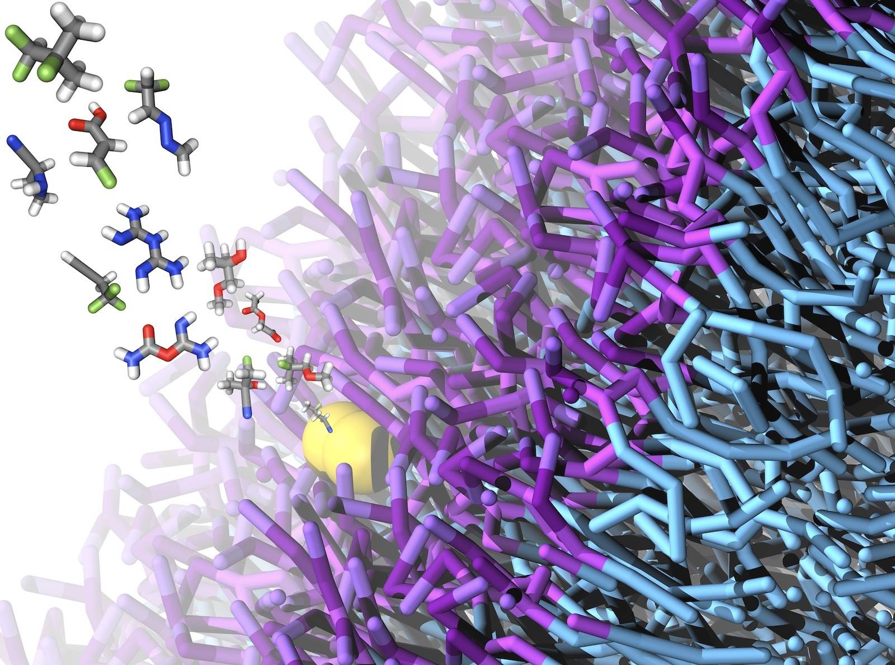

::: {.hero-banner .alt-background}

::: {.content-block}

<!-- The page's only heading, so it has to be the h1: as an h3 the homepage
had no heading landmark at all, which screen readers rely on to orient and
search engines read as the page's subject. Bootstrap's .h3 utility keeps it
looking exactly as it did -- a full-size h1 would dwarf the paragraph under
it, and this sentence is too long to carry 2.5rem.

The heading used to open "Homepage of Tristan Bereau at the ...", which spent
the h1's most valuable words on a filler label and rendered its emphasis
backwards: the institution names are links, so they take font-weight 400 while
"Homepage of Tristan Bereau at the" was bold. On a phone it also ran to seven
lines and filled the first screen before a word of content. -->

# Multiscale modeling and machine learning for molecular systems {.h3}

Tristan Bereau's group at the [Institute for Theoretical
Physics](https://www.thphys.uni-heidelberg.de), [Heidelberg
University](https://www.uni-heidelberg.de/en). We develop simulation and
machine-learning methods for soft-condensed matter and biomolecules, and use
coarse-graining to make chemical compound space tractable. Current activities
include

- Free energies from physics-informed generative models
- Coarse-graining to compress chemical space for high-throughput screening
- Molecular discovery by active learning and Bayesian optimization
- Reproducible and FAIR workflows for molecular simulation

<!-- The one time-sensitive item on the site, and it was previously reachable
only through a navbar dropdown labelled "Group", which is not where anyone
looks for a job. A notice rather than a third button: three btn-lg buttons
wrapped to a second row inside the 600px hero and the last one landed below
the fold on a 720px-tall viewport, which is the one thing a hiring call cannot
afford. It links to the listing rather than to the advert itself, so it does
not 404 in the window while the advert moves to positions_inactive/. Remove
this block, and the .hero-notice rule in index.css, once the position is
filled. -->

::: {.hero-notice}
A fully funded [**PhD position**](positions.html) on generative machine
learning for molecular thin films is currently open, reviewed on a rolling
basis.
:::

::: {.hero-buttons}
[Research landscape](research_landscape.html){.btn-action-primary .btn-action .btn .btn-success .btn-lg role="button"}
[Research topics](research_topics.html){#btn-guide .btn-action .btn .btn-info .btn-lg role="button"}
:::

<!-- Below the buttons rather than above them: this is a closing credit, and
with it in the middle the call-to-action row fell below the fold on a 720px
viewport, which is the one thing the hiring notice cannot afford. -->

What's presented here is the concerted effort of many fantastic students,
postdocs, and collaborators I've had the chance to work with.

:::

<!-- Shown, rather than used as wallpaper. This render sat behind the text at
opacity 0.15 and 1340px wide: unreadable as a picture, and it cost the body
copy contrast because the bullets fell over its busiest region. Below 1000px
it was hidden outright, so phones got no image at all. It is now a column of
the hero at full opacity, and wraps under the text when there is no room. -->

::: {.hero-image}
<!-- fig-alt rather than a markdown caption: `` renders the text
as a visible <figcaption> under the image, which is clutter in a hero. -->
{fig-alt="Small molecules partitioning into a coarse-grained lipid membrane"}
:::

:::

::: {.recent-work}

::: {.content-block}

## Recent work

```{ojs}
// Same data file and the same plain-JavaScript transposition as
// research_topics.qmd -- no Observable notebook imports, which stall
// silently. The homepage cannot go stale the way the topics page did: this
// reads whatever `scripts/fetch_papers.py` last wrote.
papers_r = FileAttachment("data/all_papers.json").json()
n_papers = Object.entries(papers_r["doi"]).length
papers = Array.from({length: n_papers}, (_, i) =>
    Object.fromEntries(
        Object.entries(papers_r).map(([column, values]) => [column, values[i]])
    )
)

// `repository` drops the two Zenodo software records, which are real outputs
// but read oddly as a headline. `conference` is kept: Split-Flows is at
// AISTATS. The export is already newest-first.
function authorList(authors) {
    const names = authors.map(a => `${a.given ? a.given[0] + ". " : ""}${a.family}`)
    return names.length > 4
        ? `${names.slice(0, 3).join(", ")} et al.`
        : names.join(", ")
}

htl.html`<ul class="recent-list">${
    papers
        .filter(p => p["journal.kind"] !== "repository")
        .slice(0, 5)
        .map(p => htl.html`<li>
            <a href="https://doi.org/${p.doi}" target="_blank">${p.title}</a>
            <div class="recent-meta">
                ${authorList(p.authors)}
                &middot; <em>${p["journal.abbreviation"] || p["journal.name"]}</em>
                ${p["journal.volume"] ? htl.html` <b>${p["journal.volume"]}</b>` : ""}
                (${p.year})
            </div>
        </li>`)
}</ul>`
```

[All publications](papers.html){.btn-action-primary .btn-action .btn .btn-success role="button"}

:::

:::

