```{ojs}
// Transposed in plain JavaScript rather than with `map` borrowed from the
// @martien/ramda notebook: an Observable notebook import drags its whole
// transitive graph over the network, and if any of it stalls the reactive
// cells below resolve to nothing at all, silently. Only Inputs.table is used
// on this page, which the OJS standard library already provides.
papers_r = FileAttachment("../data/all_papers.json").json()
n_columns = Object.entries(papers_r["doi"]).length
index_array = Array.from({length: n_columns}, (_, i) => i)
papers = index_array.map(
    i => Object.fromEntries(
        Object.entries(papers_r).map(([column, values]) => [column, values[i]])
    )
)

function displayTable(papers_) {
    return Inputs.table(papers_, {
        columns: [
        "doi",
        "title",
        "journal.name",
        "journal.volume",
        "year",
      ],
      header: {
        "journal.name": "journal",
        "journal.volume": "volume",
      },
      format: {
        doi: doi => htl.html`<a href=https://doi.org/${doi} target=_blank>${doi}</a>`,
        title: title => htl.html`${title}`,
        "journal.volume": volume => htl.html`<b>${volume}</b>`,
        year: year => htl.html`${year}`,
      },
      width: {
        "title": 10
      },
      layout: "auto",
    })
}

// Every section below selects its papers this way. The `topics` field is
// attached at export time from `data/topics.yml`, which is also where a new
// paper gets assigned to a section -- see `scripts/topics.py`. Selecting by
// coauthor instead, as this page used to, silently adopts whatever that person
// publishes next; selecting by a DOI list written into the page means the page
// has to be remembered every time a paper comes out, and it was not.
function topic(key) {
    return displayTable(papers.filter(p => p.topics.includes(key)))
}
```

# Overview

Our research sits at the interface of statistical mechanics, molecular
simulation, and machine learning. We develop multiscale methods for
soft-condensed matter and biomolecules, and we apply them to problems in which
two landscapes compound one another: the *configurational* landscape of a
single molecular system at fixed composition, and the *compositional* landscape
of chemical compound space, in which the identity of the molecule is itself the
variable. Sampling either is expensive. Having to sample both at once is what
makes molecular discovery hard.

Coarse-graining is our main instrument against both. A reduced representation
smooths the free-energy landscape and accelerates sampling; and because a small
set of bead types maps many molecules of similar shape and hydrophobicity onto
the same parametrization, it also contracts chemical space by close to an order
of magnitude. That many-to-one mapping is what makes high-throughput screening
of thermodynamic properties tractable, and what turns structure--property
relationships into design rules. It also costs chemical specificity, and a good
deal of our methodological work is concerned with measuring that price and with
recovering what the reduction discards.

Machine learning enters as a way of tailoring models to physics rather than
substituting for it. The recurring move is to take a known analytical
result---the Boltzmann distribution, a Fokker--Planck steady state,
thermodynamic integration---and impose it as an inductive bias on a generative
model, instead of letting the model infer that structure from data alone.

For an unsupervised view of the same corpus, clustered by abstract rather than
by hand, see the [research landscape](/research_landscape.html). Much of what
follows is released as open-source [software](/software.html), and all of it is
the work of the [group](/group_members.html).

# Current directions

## Free energies from generative models

::: {.column-margin}
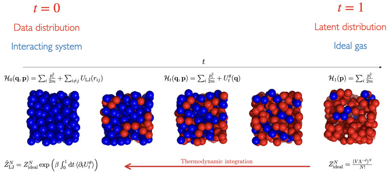
:::

Free-energy calculations remain among the most expensive routine tasks in
molecular simulation. We reformulate them as learning problems in which the
physics supplies the structure of the estimator. Neural thermodynamic
integration parametrizes the interpolating potential along the alchemical
pathway with a neural network, so that a single learned model stands in for
the ladder of intermediate states a conventional calculation has to simulate;
it is demonstrated on the excess chemical potential of a Lennard-Jones fluid.
The construction extends to solvation, where both end states are non-trivial,
by geodesic interpolation between their samples. Fokker--Planck score learning
arrives at the same goal from a different constraint: the analytical
steady-state solution for a particle in a periodic potential under constant
force is imposed on a neural score function, which recovers potentials of mean
force efficiently and is most advantageous in the low-data regime.

[Fokker-Planck score learning](/software.html#fokker-planck-score-learning){.btn-action-primary .btn-action .btn .btn-success .btn-lg role="button"}
[Neural TI](/software.html#neural-thermodynamic-integration){.btn-action-primary .btn-action .btn .btn-success .btn-lg role="button"}

```{ojs}
topic("gen-free-energy")
```

## Measure transport across resolutions

::: {.column-margin}
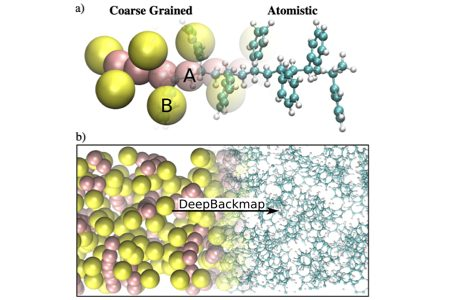
:::

Going from atomistic to coarse-grained resolution is straightforward; going
back is not. We treat the inverse---backmapping---as a probabilistic transport
problem rather than a regression. Conditional generative adversarial networks
reconstruct equilibrated atomistic structures autoregressively, bond by bond,
sampling the atomistic Boltzmann distribution without pre-equilibration, with
remarkable transferability from melt to crystalline phases and, in later work,
across chemistries. Split-Flows recasts the problem as continuous-time measure
transport: augmenting a coarse-grained configuration with auxiliary noise
dimensions renders the map to the fine-grained space one-to-one, and a flow
matched between the two resolutions supplies both a generative backmapping and,
for the first time tractably and for an arbitrary coarse-graining map, the
mapping entropy that quantifies how much information the reduction discards.

[Split-Flows](/software.html#split-flows){.btn-action-primary .btn-action .btn .btn-success .btn-lg role="button"}

```{ojs}
topic("resolution-transport")
```

## High-throughput screening of thermodynamic properties

::: {.column-margin}
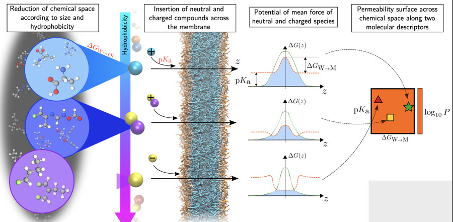
:::

Rather than arbitrarily selecting compounds, we systematically explore chemical
space according to the target property of interest. Coarse-graining is what
makes this affordable: a linear relation between bulk partitioning and the
potential of mean force turns an expensive insertion free energy into a
surrogate that can be evaluated across an entire library. We used it to screen
more than 500,000 small molecules for drug--membrane permeability, yielding a
permeability map across a sizeable part of organic chemical space, benchmarked
against experiment and released as a public dataset of coarse-grained
trajectories, insertion PMFs, and permeability coefficients. Symbolic
regression over that dataset recovers compact algebraic expressions in a
handful of physical descriptors---size, polarity, hydrogen-bonding
capacity---and the century-old Meyer--Overton correlation emerges from
hydrophobic transfer and bilayer deformation alone, without invoking
receptor-specific binding.

```{ojs}
topic("high-throughput")
```

## Molecular discovery by active learning and Bayesian optimization

::: {.column-margin}

:::

Screening is only half of discovery; the other half is deciding what to compute
next. We close that loop with active learning and Bayesian optimization on top
of rigorous coarse-grained free-energy calculations. Applied to cardiolipin,
iterative cycles inside a low-dimensional chemical-space embedding identified
small molecules predicted to bind the mitochondrial lipid selectively over
structurally similar phospholipids, and the resulting physicochemical design
rules were then used to filter a chemical-vendor database: of twenty compounds
tested, three proved selective *in vitro* and one *in vivo*. Multilevel
Bayesian optimization organizes the same idea as a funnel across resolutions,
exploring broadly where the model is cheap and exploiting where it is accurate.
The approach reaches beyond small molecules---to gas-separation polymers that
exceed the CO~2~/CH~4~ Robeson upper bound and were subsequently synthesized
and measured, and to peptide sequences whose learned embeddings support *de
novo* design.

[Multi-level BO](/software.html#multi-level-bayesian-optimization){.btn-action-primary .btn-action .btn .btn-success .btn-lg role="button"}

```{ojs}
topic("molecular-discovery")
```

## Coarse-graining as a reduction of chemical space

::: {.column-margin}
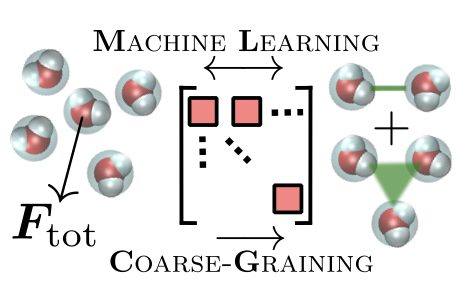
:::

Transferable coarse-grained models are useful precisely because they are
degenerate, and we study the consequences of that degeneracy quantitatively.
Varying the number of Martini bead types from 5 to 16 across thousands of
molecules establishes the resolution limit of data-driven models spanning
chemical space, and marks where transferability begins to cost chemical
specificity. Treating exploration as importance sampling over coarse-grained
representations improves coverage of the property landscape by factors of 2--10
over uniform sampling, at the scale of some $10^6$ compounds. Adjacent
questions concern how condensed-phase structure ought to be represented at
all---adapting the SLATM expansion in one-, two-, and three-body local
environments to thermodynamic observables of molecular liquids---and how far
kernel-based models can be trusted, where an audit of machine-learned hydration
free energies exposes the penalty incurred when the training database is
chemically narrow.

```{ojs}
topic("cg-chemical-space")
```

## Automated force-field parametrization

::: {.column-margin}
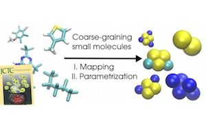
:::

High-throughput screening is only possible if parametrization requires no human
in the loop. Auto-Martini generates Martini topologies for small organic
molecules directly from SMILES, assigning the mapping, bead types, and bonded
parameters automatically. The pipeline has been rebuilt for Martini 3,
validated against expert-designed models, and exercised on a screen of 100,000
compounds from the Enamine library.

[Auto Martini](/software.html#auto-martini){.btn-action-primary .btn-action .btn .btn-success .btn-lg role="button"}

```{ojs}
topic("auto-parametrization")
```

## Reproducible and FAIR simulation workflows

::: {.column-margin}
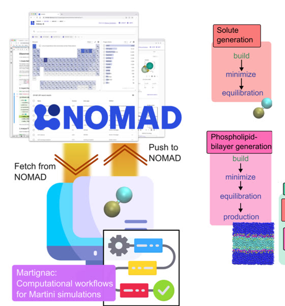
:::

Screening campaigns generate large numbers of simulations whose provenance is
easy to lose and whose results are easy to recompute by accident. Martignac
represents Martini simulations as directed acyclic graphs with full provenance
tracking, connected to the NOMAD database, so that a prior calculation is
retrieved rather than repeated. The framework is the practical end of a longer
commitment to FAIR data in materials science---community metadata schemas
spanning electronic structure, sampling, and workflows, and the case that the
transition to data-centric materials science requires shared infrastructure and
stewardship rather than algorithms alone.

[Martignac](/software.html#martignac){.btn-action-primary .btn-action .btn .btn-success .btn-lg role="button"}

```{ojs}
topic("fair-workflows")
```

# Continuing threads

## Membrane biophysics

::: {.column-margin}
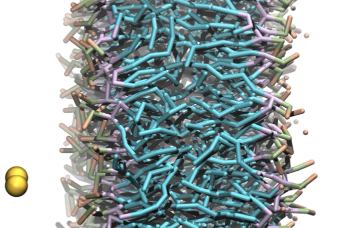
:::

Lipid membranes are the physical system our methods return to most often, and
the question we most often ask of them is which of their features are
thermodynamically dictated and which demand active cellular maintenance.
Semi-grand canonical simulations, with chemical potentials imposed on
individual lipid species, reframe membrane composition as a
constrained-equilibrium problem: acyl-tail saturation homeostasis in ectotherms
and saturation asymmetry between leaflets both emerge from thermodynamics
alone, narrowing the list of properties a cell must actively regulate. In
parallel we study how small molecules partition into membranes and reshape
them---phase separation in binary mixtures, nanoparticle contact mediated by
copolymer coronas, the bacteriostatic action of 2-phenylethanol derivatives,
the reorganization produced by nitrated fatty acids---together with the folding
and insertion thermodynamics of transmembrane peptides.

```{ojs}
topic("membranes")
```

## Kinetics of coarse-grained models

::: {.column-margin}
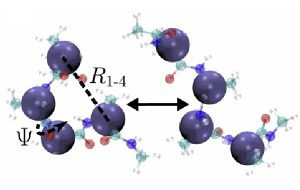
:::

Coarse-graining accelerates dynamics, and it does so unevenly: a model
parametrized against structure alone will generally misrepresent
barrier-crossing kinetics. We parametrize concurrently against static and
kinetic information, using Markov state models biased with external information
to keep the interpretation of simulation kinetics consistent. Conformational
surface hopping couples distinct force fields to distinct conformational
basins, in analogy with nonadiabatic transitions between electronic surfaces;
incorporating more surfaces improves cross-correlations systematically and
recovers barrier-crossing dynamics that a single surface cannot. Related work
identifies metastable states without hand-chosen collective variables, through
hidden Markov models of solvation substates and Gaussian-mixture variational
autoencoders whose mixture components correspond to conformational basins.

```{ojs}
topic("cg-kinetics")
```

## Non-equilibrium dynamical reweighting

::: {.column-margin}
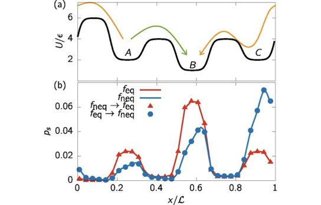
:::

We extend the concept of statistical reweighting to non-equilibrium steady
states. Stochastic thermodynamics analytically relates the forward and backward
probabilities of any pathway through the external nonconservative force, which
supplies the constraint; a maximum-caliber---maximum path entropy---formalism
then reweights microtrajectories from one driven steady state onto another. The
framework extends to collective variables, so that free-energy landscapes along
a reaction coordinate can be recovered from short driven runs.

```{ojs}
topic("nonequilibrium")
```

## Polymer and organic-materials morphology

::: {.column-margin}
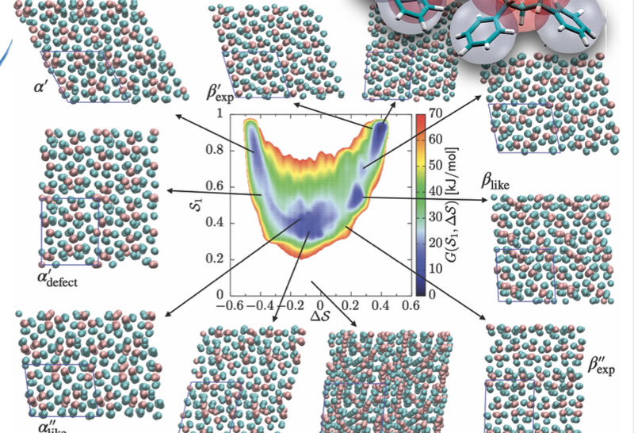
:::

Multiscale simulation of polymer morphology, where the observable of interest
sits beyond the reach of either resolution on its own. Metadynamics in a
phase space of collective variables, referenced against DFT, resolves the
free-energy landscape between polymorphs of syndiotactic polystyrene and yields
$\alpha/\beta$ free-energy differences that rationalize the experimentally
observed phase populations.

```{ojs}
topic("polymer-materials")
```

# Foundations

Earlier lines of work, largely concluded, that the current programme grew out
of.

## Static atomic multipole electrostatics

::: {.column-margin}
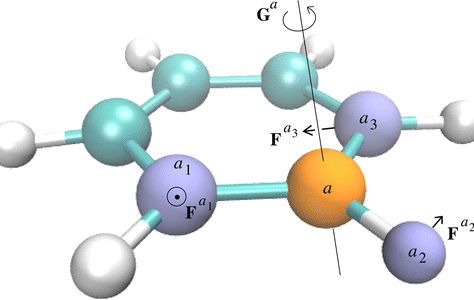
:::

Point charges are a crude description of the molecular electrostatic potential.
Static atomic multipoles, derived from the electrostatic potential through a
spherical-harmonic expansion, provide a systematically better one, and
exploiting their symmetries makes force propagation affordable enough for
condensed-phase molecular dynamics. Applications include free energies of
hydration, two-dimensional infrared spectroscopy of solvation dynamics, and the
$\sigma$-hole of halogenated compounds, where quadrupolar terms on the adjacent
atoms prove necessary.

```{ojs}
topic("multipoles")
```

## Machine learning of non-covalent interactions

::: {.column-margin}

:::

Physics-based potentials with machine-learned coefficients, combining atomic
multipoles and many-body dispersion for accurate and transferable non-covalent
interactions. The coefficients are learned by kernel ridge regression across
both conformations and composition of small organic molecules; a
Voronoi-tessellation route to van der Waals coefficients dispenses with
explicit electron densities altogether.

[IPML](/software.html#ipml){.btn-action-primary .btn-action .btn .btn-success .btn-lg role="button"}

```{ojs}
topic("noncovalent-ml")
```

## Peptide coarse-graining and folding cooperativity

::: {.column-margin}
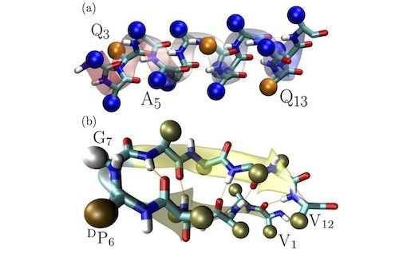
:::

A top-down, implicit-solvent coarse-grained peptide model, used to study
secondary and tertiary structure formation across environments and scenarios:
$\alpha$-helix against $\beta$-sheet folding, the microcanonical analysis that
locates the origin of folding cooperativity in the interplay between the two,
the structural alignment of capsid interfaces, and peptide--membrane
interactions from a simple cross-parametrization.

[PhD thesis](files/thesis.pdf){.btn-action-primary .btn-action .btn .btn-success .btn-lg role="button"}
[peptideB](/software.html#peptideb){.btn-action-primary .btn-action .btn .btn-success .btn-lg role="button"}

```{ojs}
topic("peptide-cg")
```

## Early methodological work

Assorted early work on estimators and integration schemes: optimized
convergence for multiple-histogram analysis, a multi-timestep integrator for
the modified Andersen barostat, and a simulated molecular walker.

```{ojs}
topic("early-methods")
```
